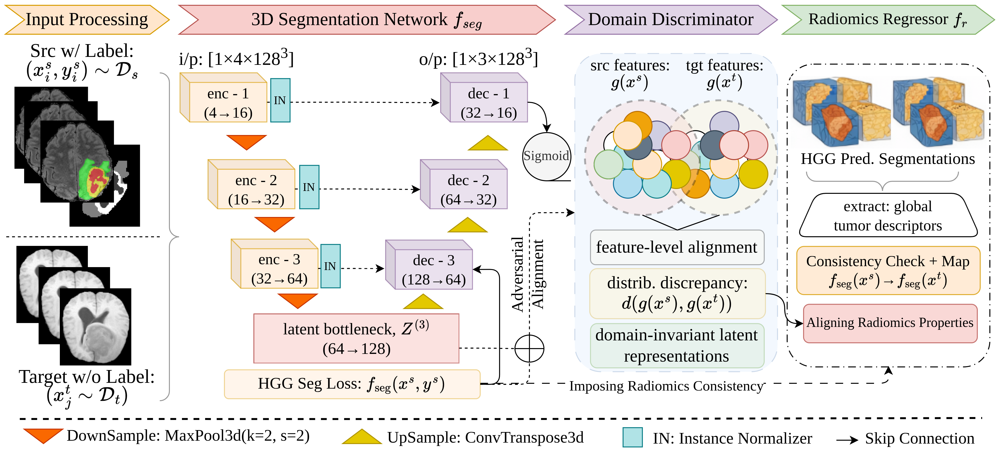

# RADIANT: A Radiomics-Aware Domain-Informed Adversarial Network for High-Grade to Low-Grade Brain Tumor Adaptation

This repository contains the source code for **RADIANT**, an unsupervised domain adaptation framework for 3D brain tumor segmentation. The framework adapts a model trained on high-grade glioma (HGG) data to low-grade glioma (LGG) data without requiring LGG annotations. RADIANT treats domain adaptation as a structure-preserving learning problem rather than relying on naive distributional alignment alone. A radiomics regressor is attached to the shared bottleneck representation and trained to predict global tumor descriptors, first from ground truth annotations on the source domain, then from the model's own predictions on the target domain through a self-feedback consistency loss. Domain invariance at the bottleneck is further enforced through a gradient reversal layer with an adversarial discriminator, along with a correlation alignment term that matches second-order feature statistics between domains.

Methodology overview:




## Directories

```
├── src/
│   ├── core/
│   │   ├── config.py
│   │   ├── data.py
│   │   └── radiomics.py
│   ├── modeling/
│   │   ├── models.py
│   │   └── losses.py
│   └── training/
│       ├── train.py
│       └── evaluate.py
├── scripts/
│   ├── precompute_radiomics.py
│   ├── pretrain.py
│   ├── adapt.py
│   ├── adapt_resume.py
│   └── evaluate_checkpoint.py
├── notebooks/
├── fig/
├── checkpoints/
├── pyproject.toml
└── README.md
```

`core` holds configuration constants, data loading and dataset classes, and radiomics feature extraction and caching. `modeling` holds the segmentation backbone, the radiomics regressor, the domain discriminator, and the loss functions that operate on their outputs. `training` holds the supervised pretraining loop, the adaptation loop, and the shared validation routine. `scripts` provides the command line entry points that tie these together for feature precomputation, pretraining, adaptation, resumed adaptation, and checkpoint evaluation.

## Dataset

RADIANT is evaluated on the BraTS benchmark datasets:

> Each case contains four co-registered MRI modalities, FLAIR, T1, T1ce, and T2. Cases are organized under separate `HGG` and `LGG` directories. HGG cases form the labeled source domain, and LGG cases form the unlabeled target domain, with ground truth withheld during adaptation.

## Setup

Install the package in editable mode from the repository root:

```
pip install -e .
```

This makes the `core`, `modeling`, and `training` packages under `src/` importable from anywhere, including from within `scripts/`.

## Usage

```
python scripts/precompute_radiomics.py --root /path/to/brats_data
python scripts/pretrain.py --root /path/to/brats_data
python scripts/adapt.py --root /path/to/brats_data --checkpoint checkpoints/sup_epoch_50.pth
python scripts/evaluate_checkpoint.py --root /path/to/brats_data --checkpoint checkpoints/adapt_epoch_200.pth
```

`adapt_resume.py` follows the same arguments as `adapt.py`, with an additional `--resume` flag pointing to a checkpoint saved mid-adaptation.

## Requirements

The following Python packages are required to run the code:

- PyTorch >= 2.0.0
- NumPy >= 1.24.0
- nibabel >= 5.0.0
- scikit-image >= 0.21.0
- tqdm >= 4.66.0
- pyradiomics >= 3.0.1

## Citation

Will be updated.